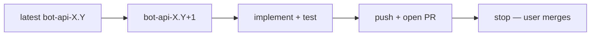

# 🤖 Agent Development Rules & Guidelines

This document serves as the **single source of truth** for all development rules, coding standards, and agent behavior guidelines for this project.

## 📋 Table of Contents

- [🤖 Agent Development Rules \& Guidelines](#-agent-development-rules--guidelines)
  - [📋 Table of Contents](#-table-of-contents)
  - [🗣️ Communication \& Response Style](#️-communication--response-style)
  - [🐹 Go Development Rules](#-go-development-rules)
    - [Core Principles](#core-principles)
    - [Go Version \& Documentation](#go-version--documentation)
    - [Naming \& Structure Standards](#naming--structure-standards)
    - [Error Handling \& Types](#error-handling--types)
    - [Best Practices](#best-practices)
    - [Concurrency Rules](#concurrency-rules)
  - [📝 File Editing Strategy](#-file-editing-strategy)
    - [Core Principle: Single-Action Complete Revisions](#core-principle-single-action-complete-revisions)
    - [✅ DO: Best Practices](#-do-best-practices)
    - [❌ DON'T: Avoid These](#-dont-avoid-these)
  - [🏗️ Code Quality \& Architecture](#️-code-quality--architecture)
  - [🔧 Build \& Static Analysis](#-build--static-analysis)
  - [⚠️ Error Handling \& Constants](#️-error-handling--constants)
  - [🔄 Development Workflow](#-development-workflow)
    - [Information Gathering](#information-gathering)
    - [Feedback \& Communication](#feedback--communication)
    - [Development Process](#development-process)
  - [📡 Telegram Bot API Updates](#-telegram-bot-api-updates)
    - [PR \& Branch Policy](#pr--branch-policy)
    - [Implementation Workflow](#implementation-workflow)
    - [Type \& Config Patterns](#type--config-patterns)
    - [Verification](#verification)
  - [📋 Rule Application](#-rule-application)

---

## 🗣️ Communication & Response Style

| Rule                      | Description                                                                                                                     |
| ------------------------- | ------------------------------------------------------------------------------------------------------------------------------- |
| **Language Policy** 🌐     | Always reason and edit in English, but answer user in their prompt language                                                     |
| **Response Format** 📊     | Always format responses using structured tables with emojis instead of long text blocks                                         |
| **Visual Clarity** ✨      | Use tables for better visual clarity and quick scanning. Replace lengthy paragraphs with concise, emoji-enhanced tabular format |
| **Present in diagrams** 📊 | Present complex flows and business in Mermaid diagrams when appropriate                                                         |
| **Continuation Style** ⚡  | Continue without stopping to reiterate or provide feedback, and don't report until all planned work is finished                 |

---

## 🐹 Go Development Rules

### Core Principles
| Principle                      | Implementation                                                                      |
| ------------------------------ | ----------------------------------------------------------------------------------- |
| **Self-documenting code** 📖    | No comments in logic—clear names and structure speak for themselves; **Telegram API types** in `types.go` use exported field comments mirroring [official docs](https://core.telegram.org/bots/api) |
| **Professional standards** 👨‍💻   | Write like a professional Go developer would, without unnecessary code bloat or inf |
| **Minimum viable** 🎯           | Focus on minimum viable implementation                                              |
| **Architecture first** 🏛️       | Audit before coding: scan repo, read related packages, plan all changes             |
| **Follow existing patterns** 🔄 | Keep file layout and conventions intact unless asked otherwise                      |

### Go Version & Documentation
| Item                         | Details                                                                                               |
| ---------------------------- | ----------------------------------------------------------------------------------------------------- |
| **Go Version** 🔢             | Current Go version: 1.25. Check with @Web when want to know what's changed                            |
| **Documentation Strategy** 📚 | Use `go doc`, `go tool` for Go packages;  `rg / grep` for external libs and generally everything else |
| **Complete Code** ✅          | Write complete code, no TODOs or placeholders                                                         |

### Naming & Structure Standards
| Category              | Rules                                                                                               |
| --------------------- | --------------------------------------------------------------------------------------------------- |
| **Case Convention** 🔤 | In Go: Use MixedCaps/mixedCaps (no underscores); In Python: snake_case                              |
| **Acronyms** 🔤        | Acronyms all uppercase (HTTP, URL, ID, API)                                                         |
| **Getters** 🎣         | No "Get" prefix for getters (`user.Name()` not `user.GetName()`)                                    |
| **Interfaces** 🔌      | Single method ends in "-er" (Reader, Writer), otherwise "-able" (Readable, Writable)                |
| **Organization** 📂    | Group related constants/variables/types together                                                    |
| **Packages** 📁        | One package per directory with short, meaningful names                                              |
| **Indentation** ↹     | **Always use tab for indentation in Go code**, **Always use spaces for indentation in Python code** |

### Error Handling & Types
| Aspect                | Implementation                                                 |
| --------------------- | -------------------------------------------------------------- |
| **Error Checking** ⚠️  | Check errors immediately, no panic for normal errors           |
| **Error Wrapping** 🎁  | Use error wrapping: `fmt.Errorf("failed to process: %w", err)` |
| **Custom Errors** 🔧   | Consider custom error types for complex cases                  |
| **Interface Types** 🔄 | Use `any` instead of `interface{}`                             |

### Best Practices
| Practice                  | Description                                                               |
| ------------------------- | ------------------------------------------------------------------------- |
| **Testing** 🧪             | Table-driven tests preferred                                              |
| **Context Usage** ⏱️       | Use context for cancellation/timeouts                                     |
| **Global Variables** 🚫    | Avoid global variables                                                    |
| **Composition** 🔗         | Prefer composition over inheritance                                       |
| **Embedding** 📎           | Use embedding judiciously                                                 |
| **Defer Usage** ⏳         | Defer only when necessary                                                 |
| **Memory Optimization** 🧠 | Preallocate slices when length known                                      |
| **String Building** 🔨     | Use strings.Builder for concatenation, sync.Pool for frequent allocations |

### Concurrency Rules
| Rule                    | Implementation                                                   |
| ----------------------- | ---------------------------------------------------------------- |
| **Core Philosophy** 🧠   | Share memory by communicating, not communicate by sharing memory |
| **Channel Usage** 📡     | Channels for coordination, mutexes for state                     |
| **Critical Sections** ⚡ | Keep critical sections small                                     |
| **Error Groups** 👥      | Use errgroup for concurrent tasks                                |
| **Leak Prevention** 🚰   | Prevent goroutine leaks                                          |
| **Context Usage** ⏱️     | Use context for cancellation/timeouts/lifecycle management       |

---

## 📝 File Editing Strategy

### Core Principle: Single-Action Complete Revisions

| Strategy                    | Implementation                                                                                             |
| --------------------------- | ---------------------------------------------------------------------------------------------------------- |
| **Comprehensive Updates** 🔄 | Consolidate ALL necessary changes into bulk comprehensive update, if they're related                       |
| **Planning** 📋              | Analyze the entire scope of required modifications before starting                                         |
| **Related Changes** 🔗       | Plan all related changes (imports, dependencies, refactoring) together                                     |
| **Complete Delivery** ✅     | Deliver complete, functional code in a single edit actions bulk, where appropriate                         |
| **Maximum Impact** ⚡        | Prefer bulk whole-file edits over sequential micro-edits for efficiency; embrace multiple tool-use at once |

### ✅ DO: Best Practices
| Practice                   | Description                                    |
| -------------------------- | ---------------------------------------------- |
| **Audit First** 🔍          | Read and understand the complete file context  |
| **Plan Comprehensively** 📊 | Identify all changes needed across the file    |
| **Verify Completeness** ✔️  | Ensure the edit delivers fully functional code |

### ❌ DON'T: Avoid These
| Anti-Pattern            | Description                                                    |
| ----------------------- | -------------------------------------------------------------- |
| **Incomplete States** ⚠️ | No incremental additions that leave files in incomplete states |
| **Placeholders** 🚷      | No "TODO" or placeholder comments requiring follow-up edits    |

---

## 🏗️ Code Quality & Architecture

| Requirement                   | Implementation                                                                      |
| ----------------------------- | ----------------------------------------------------------------------------------- |
| **Architectural Cleanness** 🏛️ | Require architectural cleanness and slickness in implementation across the codebase |
| **Professional Standards** 👨‍💻  | Write code like a professional developer would                                      |
| **Lint Compliance** 🔍         | **Never ignore lint warnings and fix them right away**                              |
| **Quality Gates** ✅           | Maintain high code quality standards throughout                                     |

---

## 🔧 Build & Static Analysis

| Rule                       | Tool                                                   | Reason                                      |
| -------------------------- | ------------------------------------------------------ | ------------------------------------------- |
| **No Full Compilation** 🚫  | Do not invoke `go build` for intermediate checks       | Avoid unnecessary full compilation overhead |
| **Static Analysis Only** 🔍 | Use `go vet` exclusively for static analysis           | Efficient validation without compilation    |
| **Development Checks** ⚡   | Prefer lightweight validation tools during development | Faster feedback loops                       |

---

## ⚠️ Error Handling & Constants

| Rule              | Implementation                                                                                        |
| ----------------- | ----------------------------------------------------------------------------------------------------- |
| **No New Keys** 🚫 | Do not invent new string keys - reuse existing ones if there are already some defined in the codebase |
| **Consistency** 🔄 | Maintain consistency with established error handling patterns                                         |

---

## 🔄 Development Workflow

### Information Gathering
| Step                      | Action                                                                                         |
| ------------------------- | ---------------------------------------------------------------------------------------------- |
| **Tool Usage** 🛠️          | Use provided tools extensively instead of guessing                                             |
| **Code Inspection** 🔍     | Inspect code when unsure: list project structure, read whole files, search symbols in codebase |
| **Documentation First** 📚 | Check docs first before implementing                                                           |

### Feedback & Communication
| Process                    | Implementation                                                                         |
| -------------------------- | -------------------------------------------------------------------------------------- |
| **Interactive Feedback** 💬 | Always call `interactive_feedback` MCP when asking questions or completing requests    |
| **Continuous Feedback** 🔄  | Continue calling `interactive_feedback` until user feedback is empty, then end request |
| **Completion Reporting** 📋 | Request feedback or ask when finished or unsure                                        |

### Development Process
| Phase                         | Requirements                                                            |
| ----------------------------- | ----------------------------------------------------------------------- |
| **English Only** 🇺🇸            | Always think in English regardless of prompt language                   |
| **Complete Implementation** ✅ | No placeholders - write complete code                                   |
| **Multiple Tools** ⚡          | Use multiple tools at once to achieve the best result                   |
| **Maximum Impact** ⚡          | Prefer batch file edits over single separate micro-edits for efficiency |

---

## 📡 Telegram Bot API Updates

Library tracks [Bot API changelog](https://core.telegram.org/bots/api-changelog). Implement **one version per PR**; do not skip versions.

### PR & Branch Policy

| Rule | Detail |
| ---- | ------ |
| **Never merge PRs** 🚫 | Agent must **not** merge PRs (`gh pr merge`, squash, rebase, auto-merge). User merges manually. |
| **Agent creates only** ✅ | Implement → push branch → `gh pr create --base master` → stop. |
| **"Proceed" means** ⏭️ | Implement the **next** Bot API version — **not** merge the open PR. |
| **Branch parent** 🌿 | New version from the **latest `bot-api-X.Y`** branch (e.g. `bot-api-10-3`), not `master`, while earlier PRs may still be open. PR base remains `master`. |
| **Version PR scope** 📦 | Bot API branches touch library code only — not `AGENTS.md`, not `.cursor/`. |

### Implementation Workflow

| Step | Action |
| ---- | ------ |
| **Source** 📜 | Changelog + [Bot API docs](https://core.telegram.org/bots/api); parity schema: gitignored `api.json` from [PaulSonOfLars spec](https://github.com/PaulSonOfLars/telegram-bot-api-spec) |
| **Branch** 🌿 | `bot-api-X.Y` (one version per PR) |
| **Files** 📂 | `types.go`, `configs.go`, `helper_structs.go`, `helper_methods.go`, `upload.go`, `bot.go`, tests, examples — touch only what the changelog needs |
| **Commit** 💬 | `Add Telegram Bot API X.Y support` or focused fix title for the same version |
| **Validate** ✅ | `go vet ./...` → `go test ./...` → optional `go test -tags=api_parity ./...` |

### Type & Config Patterns

| Area | Pattern |
| ---- | ------- |
| **Configs** | `*Config` + `method()` + `params()` (+ `files()` if uploads); embed bases from `helper_structs.go` |
| **Helpers** | `New*` constructors; bot wrappers in `bot.go` when return ≠ `Message` |
| **Inbound unions** | Flattened struct + discriminator (`TransactionPartner`-style), not interface JSON |
| **Outbound polymorphism** | Small interfaces (`InputMedia`, …) or concrete structs with `Type` in `New*` |
| **Field order** | Match official docs for **new** fields/types; do not mass-reorder legacy structs |
| **Optional nested send params** | Value type + `AddInterfaceNonZero` (e.g. `LinkPreviewOptions`, `ReplyParameters`, `EphemeralMessageParameters`) — not pointers |
| **Optional pointers** | Use `*T` + `AddInterface` only where the repo already does (e.g. `SuggestedPostParameters`, edit `ReplyMarkup`) |
| **String enums** | Named constants + predicate helpers (`Left()`, `Center()`, `Right()`, `Primary()`, …) where useful |
| **Compile checks** | `parity_interfaces_test.go`: `_ Chattable = …{}` / `_ Fileable = …{}` |

### Verification

| Check | Command |
| ----- | ------- |
| Static analysis | `go vet ./...` |
| Unit tests | `go test -count=1 ./...` |
| API parity | `curl -fsSL -o api.json https://raw.githubusercontent.com/PaulSonOfLars/telegram-bot-api-spec/main/api.json && go test -tags=api_parity -run '^TestAPIParity' -count=1 .` |

Judge **shipped** by `master`; judge **implemented** by the latest `bot-api-X.Y` branch when PRs are still open. Git tags may lag `master`.

### Local-only agent files

| Path | In repo? |
| ---- | -------- |
| `AGENTS.md` | ✅ Yes — this file |
| `.cursor/` | ❌ Gitignored — IDE/agent rules stay local |
| `CLAUDE.md` | ❌ Gitignored |

---

## 📋 Rule Application

This document applies to **all file types and editing scenarios** across the codebase. These rules should be followed consistently to maintain code quality, architectural integrity, and development efficiency.
